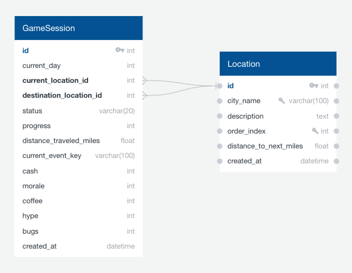

# SILICON VALLEY TRAIL

## Overview

Silicon Valley Trail is a replayable, Oregon Trail–inspired simulation game where you lead a startup team from San Jose to San Francisco. Each turn, you make strategic decisions to manage limited resources while navigating dynamic events and weather-driven challenges.

The game blends deterministic logic with randomness and real-time weather data to create a balanced and engaging experience. Built with a modular Flask architecture, the project focuses on clean design, scalability, and testability.

---

## Documentation

- [SILICON VALLEY TRAIL](#silicon-valley-trail)
  - [Overview](#overview)
  - [Documentation](#documentation)
    - [Quick Start](#quick-start)
    - [API Key Setup](#api-key-setup)
      - [Running with Mock Data (No API Key Needed)](#running-with-mock-data-no-api-key-needed)
  - [Architecture](#architecture) - [Architecture Layers](#architecture-layers) - [Project Structure](#project-structure)
    - [Dependencies](#dependencies)
      - [Tech Stack](#tech-stack)
      - [Dependencies](#dependencies-1)
    - [Running Tests](#running-tests)
      - [AI Usage](#ai-usage)
  - [DESIGN NOTES](#design-notes)
    - [1. Game Loop and Balance Approach](#1-game-loop-and-balance-approach)
    - [2. Why OpenWeather API and how it affects gameplay](#2-why-openweather-api-and-how-it-affects-gameplay)
    - [API Choice and Gameplay Impact](#api-choice-and-gameplay-impact)
    - [3. Data Modeling ( state, events, persistence)](#3-data-modeling--state-events-persistence)
    - [Data Modeling (State, Events, Persistence)](#data-modeling-state-events-persistence)
    - [4. Error Handling (Network Failures, Rate Limits)](#4-error-handling-network-failures-rate-limits)
    - [5. Tradeoffs and if I had more time](#5-tradeoffs-and-if-i-had-more-time)
      - [Tradeoffs](#tradeoffs)
      - [If I Had More Time](#if-i-had-more-time)

---

### Quick Start

1. Python
   Make sure Python 3.10+ is installed:

   ```bash
   python --version
   ```

   If not installed, download from [Python](https://www.python.org/downloads/)

2. Clone the repository

   ```bash
   git clone repo-url
   cd path/to/silicon-valley-trail
   ```

3. Create and activate a virtual environment

   ```bash
   python -m venv venv
   # mac
   source venv/bin/activate
   # windows
   venv\Scripts\activate
   ```

4. Install dependencies

   ```bash
   pip install -r requirements.txt
   ```

5. Set up environment variables
   create .env file in the project root:

   ```env
   OPENWEATHER_API_KEY=your_api_key_here
   ```

   Note:
   - The app uses SQLite (no installation required).
   - To use a different database, add DATABASE_URL to your .env file
   - Database is automatically created and seeded on first run

6. Run the application

   ```bash
   flask --app game run --port 8000 --debug
   ```

7. Open in browser
   ```code
   http://127.0.0.1:8000
   ```

### API Key Setup

This project uses the OpenWeather API to integrate real-world weather into gameplay.

Steps:

1. Create an account on OpenWeather.
2. Generate an API key.
3. Add it to your .env file:

Best Practices

- Never hardcode API keys in source code.
- Never commit .env to GitHub.
- Always use environment variables.

Example .gitignore

```bash
.env
venv/
__pycache__/
*.pyc
instance/
```

You can also use gitignore from [github/gitignore](https://github.com/github/gitignore/tree/main)

#### Running with Mock Data (No API Key Needed)

If you want to run without external API:

Modify config:

```python
USE_MOCK_WEATHER = True
```

Use case :

- uses static weather data
- Avoids API rate limits
- Ideal for testing and demos

## Architecture

The application follows a modular Flask architecture with clear separation of concerns across routing, business logic, persistence, and external integrations. It uses [Application Factories](https://flask.palletsprojects.com/en/stable/patterns/appfactories/) and [Flask Blueprints](https://flask.palletsprojects.com/en/stable/blueprints/) to keep the codebase organized, maintainable, and easier to scale.

This structure also improves testability by allowing components to be initialized, isolated, and tested independently.

#### Architecture Layers

- **Frontend (Jinja)**: Renders game UI (menu, gameplay, events)
- **Routing (Flask Blueprints)**: Handles requests and delegates to services
- **Service Layer**: Core game logic (actions, progression, events, win/loss)
- **Persistence (SQLite + SQLAlchemy)**: Stores game state and resources
- **Static Data**: Defines locations, events, and action effects
- **External API**: Weather integration (OpenWeather) with mock fallback for reliability

#### Project Structure

```text
silicon-valley-trail/
│
├── data/
│   ├── mock_api_data.py      # Mock weather, events, initial state
│   └── seed_data.py          # Database seeding (locations)
│
├── game/
│   ├── __init__.py           # App factory
│   │
│   ├── errors/
│   │   ├── __init__.py
│   │   └── handlers.py       # Error handling (404, etc.)
│   │
│   ├── models/
│   │   ├── __init__.py
│   │   └── models.py         # SQLAlchemy models (GameSession, Location)
│   │
│   ├── routes/
│   │   ├── __init__.py
│   │   └── pages.py          # HTTP routes / controllers
│   │
│   ├── services/
│   │   ├── __init__.py
│   │   ├── game_service.py   # Core game logic
│   │   ├── event_service.py  # Event handling logic
│   │   ├── weather_service.py# Weather API + mock fallback
│   │   └── result_types.py   # Shared result/response structures
│   │
│   ├── templates/            # Jinja templates (UI)
│   │
│   ├── utils/
│   │   ├── __init__.py
│   │   ├── state.py          # Game state helpers
│   │   └── utils.py          # Utility functions
│
├── tests/                    # Pytest test suite
├── .env.example              # Example environment variables
├── requirements.txt
├── run.py                    # Entry point
└── README.md

```

### Dependencies

#### Tech Stack

- **Frontend**: Jinja2 (server-rendered UI)
- **Backend**: Flask, SQLAlchemy
- **Database**: SQLite (default), configurable via `DATABASE_URL`
- **External API**: OpenWeather (weather-driven gameplay)
- **Testing**: Pytest

#### Dependencies

- Flask — web framework
- Flask-SQLAlchemy — ORM for database interactions
- Flask-Migrate — database migrations
- Flask-CORS — cross-origin support
- python-dotenv — environment variable management
- requests — HTTP client for external API calls

**Testing**

- pytest — testing framework
- pytest-mock — mocking utilities

### Running Tests

This project uses **pytest** for unit testing.

Run all tests

```pytest
pytest
```

Run specific test file

```bash
pytest tests/test_events.py
```

Run with verbose output

```bash
pytest -v
```

Note:

- Tests are isolated and do not depend on external APIs (mock data is used)
- Ensure your virtual environment is activated before running test

#### AI Usage

**During Development**

AI tools were used to support the development process in the following ways:

- Brainstorming system architecture and application design
- Generating mock data (events, locations)
- Assisting with debugging (Flask routes, state management issues, edge cases)
- Improving documentation clarity and structure
- Suggesting best practices

All AI-generated suggestions were carefully reviewed and validated against trusted sources, including official documentation, technical blogs (e.g., Real Python, freeCodeCamp), and course materials (Coursera, YouTube).

**In Application**

- No AI is directly integrated into the gameplay.
- All game logic, events, and outcomes are deterministic or rule-based.

---

## DESIGN NOTES

### 1. Game Loop and Balance Approach

**Game Loop**

- The game is played in daily turns, with a total limit of **20 days** to reach San Francisco
- - The journey is structured across **12 real-world locations** (seeded into the database when game starts)
- Each turn, the player chooses one action (e.g., travel, rest, work, marketing)
- Actions update core resources:
  - cash
  - morale
  - coffee
  - hype
  - bugs
- If the player chooses **travel**:
  - the team moves to the next location
  - distance traveled (miles) is accumulated and used to calculate overall progress (%)
  - weather effects are applied
  - a location-based event may be triggered
- After every turn, the system checks for **win/loss conditions**

**Balance Approach**

- Designed around meaningful tradeoffs:
  - short-term gains (cash, hype) can increase risk (bugs, morale loss)
  - recovery actions improve stability but slow overall progress
- Resource management is critical:
  - neglecting key resources can quickly lead to loss
- The **20-day limit** creates time pressure:
  - players must balance survival with forward momentum
  - inefficient decisions can prevent reaching the destination in time.

### 2. Why OpenWeather API and how it affects gameplay

### API Choice and Gameplay Impact

I chose the **OpenWeather API** because it was simple to integrate, lightweight, and able to influence gameplay in a meaningful way. Rather than using an API only for display, I used weather data to affect player decisions and game state.

**Why this API**

- Easy to integrate within a short project timeline
- Adds real-world variability to the game
- Fits naturally with location-based travel

**Gameplay impact**

- Weather is fetched for the current location
- Conditions such as **Rain**, **Fog**, or **Clear** influence game effects and make each turn less predictable
- This adds variety and reinforces the travel/resource-management theme

**Reliability**

- Mock weather data is used as a fallback for testing and failure handling
- This keeps gameplay working even without a live API response

### 3. Data Modeling ( state, events, persistence)

### Data Modeling (State, Events, Persistence)

The data model was designed to keep the game state simple, explicit, and easy to update on each turn.



**State**

- A `GameSession` represents the current run of the game
- It stores the player’s evolving state, including:
  - current location
  - destination
  - current day
  - distance traveled in miles
  - progress percentage
  - resources such as cash, morale, coffee, hype, and bugs
  - status fields used to determine win/loss outcomes

**Events**

- Events are defined as structured Python mock data rather
  than database tables
- Each location has its own set of event definitions, making it easier to customize gameplay by city
- Events can apply direct effects or present player choices with different outcomes
- Keeping events in data structures made iteration faster during balancing and development

**Persistence**

- Game state is persisted in SQLite using SQLAlchemy ORM
- The `Location` table stores the 12 seeded real-world locations used in the journey
- The `GameSession` table stores the active game state so progress can be tracked across requests
- This separation keeps static reference data (locations) distinct from dynamic gameplay state (session/resources/progress)

This design made it easier to reason about the system, test components independently, and update game state consistently after each turn.

### 4. Error Handling (Network Failures, Rate Limits)

The weather service is designed to fail gracefully so the game remains playable even when the external API is unavailable.

- Handles timeouts, network failures, and invalid API responses
- Falls back to mock/default weather data if a request fails
- Supports mock mode for testing and development without relying on live API calls
- Prevents the weather API from becoming a single point of failure

This keeps gameplay stable while still benefiting from external data when available.

**Error Handling (Application Level)**

In addition to handling external API failures, the application includes basic Flask-level error handling for development and user experience.

**Debug Mode (Development)**

- Debug mode is enabled during development to provide detailed error messages and an interactive debugger
- This helps quickly identify issues during local development

```bash
export FLASK_APP=game
export FLASK_DEBUG=1
```

**Custom Error Handlers**
• Custom error handlers are implemented using Flask’s @errorhandler decorator
• This allows the app to return user-friendly responses instead of default error pages
• Example use cases:
• handling 404 (page not found)
• handling unexpected server errors (500)

### 5. Tradeoffs and if I had more time

#### Tradeoffs

- Using a single API kept the implementation simple and reliable within the time constraint
- Events are stored as in-code data rather than fully normalized database tables to reduce complexity
- Weather effects are intentionally lightweight to avoid overly punishing gameplay

#### If I Had More Time

**Gameplay & UI**

- Improve UI/UX with better styling and more polished interactions
- Integrate additional APIs (e.g., Google Maps Routes API for travel and traffic data, Eventbrite/Meetup/Luma APIs for real-world events) to make gameplay more dynamic and location-aware
- Expand test coverage for core game logic and edge cases

**Backend & System Design**

- Refactor data models (events/resources) into more structured schemas for easier scaling
- Improve API structure for clearer separation of concerns

**Reliability & Performance**

- Implement simple caching for weather data (per-city with short TTL)
- Add structured logging for better debugging and monitoring
- Improve network resilience with explicit timeout handling and graceful fallbacks
- Implement integration testing to validate end to end testing
